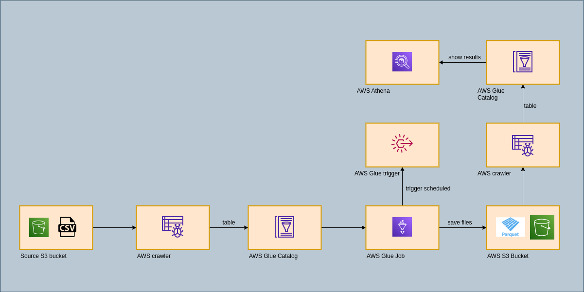

# AWS DATA PIPELINE GLUE
> This project show data pipeline with aws glue.
> Live demo [_here_](#).

## Table of Contents
* [General Info](#general-information)
* [Technologies Used](#technologies-used)
* [Features](#features)
* [Screenshots](#screenshots)
* [Project Status](#project-status)
* [Contact](#contact)

## General Information
- This project was created because I wanted create pipeline with aws glue.

## Technologies Used
- Python - version 3.10.6

## Features
List the ready features here:
- Create an S3 bucket with folders for csv files and parquet files, 
- upload csv file with customer data,
- Create database in AWS Glue,
- Create crawler in AWS Glue for csv file,
- Run crawler and create table from csv file,
- Add jobs for create three parquet files with actions: aggregate, rename field, select fields,
- Add sample of parquet files,
- Create trigger for run fobs in schedule,
- Add crawlers for create tables in database using parquets files,
- Add athena for show results frokm database tables,

## Screenshots
Schematic diagram

Page with project workflow

## Project Status
Project is: in_progress

## Contact
Created by [@DevGua]() - feel free to contact me!
